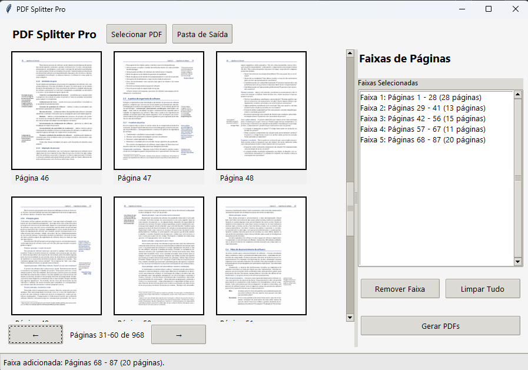

# PDF Splitter Pro

Uma aplicação desktop para dividir arquivos PDF em múltiplos documentos de forma visual e intuitiva.

## 📋 Descrição

**PDF Splitter Pro** é uma ferramenta com interface gráfica que permite visualizar páginas de documentos PDF e dividir o documento em múltiplos arquivos, selecionando intervalos específicos de páginas. Ideal para quem precisa extrair capítulos, seções ou partes específicas de documentos PDF grandes.



## ✨ Funcionalidades

- **Visualização de miniaturas**: Pré-visualização das páginas do PDF
- **Navegação simplificada**: Navegue facilmente entre grandes conjuntos de páginas
- **Seleção visual**: Selecione intervalos de páginas por cliques nas miniaturas
- **Gerenciamento de intervalos**: Adicione, remova ou limpe intervalos de páginas
- **Personalização**: Escolha a pasta de destino para os novos PDFs
- **Processamento em background**: Processamento em thread separada com barra de progresso

## 🔧 Requisitos

- Python 3.6 ou superior
- Bibliotecas:
  - PyPDF2
  - PyMuPDF (fitz)
  - Pillow
  - tkinter (normalmente incluído na instalação padrão do Python)

## 📥 Instalação

1. Clone este repositório ou baixe os arquivos
2. Instale as dependências necessárias:

```bash
pip install PyPDF2 PyMuPDF Pillow
```

3. Execute o aplicativo:

```bash
python cortar.py
```

## 🚀 Como usar

1. **Selecionar PDF**: Clique em "Selecionar PDF" para abrir o documento que deseja dividir
2. **Criar intervalos**:
   - Clique na primeira página do intervalo (ela ficará destacada)
   - Clique na última página do intervalo para concluir a seleção
   - O intervalo será adicionado à lista e as páginas selecionadas desaparecerão da visualização
3. **Gerenciar intervalos**:
   - Use "Remover Faixa" para excluir um intervalo selecionado (páginas retornarão à visualização)
   - Use "Limpar Tudo" para remover todos os intervalos
4. **Definir pasta de saída** (opcional): Selecione o diretório onde os novos PDFs serão salvos
5. **Gerar PDFs**: Clique em "Gerar PDFs" para criar os novos arquivos conforme os intervalos definidos

## ⌨️ Atalhos de teclado

- `Ctrl+O`: Abrir um arquivo PDF
- `Delete`: Remover o intervalo selecionado

## 📊 Organização de arquivos de saída

Os arquivos são salvos no formato:
- `Parte_[número]_[nome-do-arquivo-original].pdf`
- Se já existir um arquivo com o mesmo nome, será usado: `Parte_[número]_[contador]_[nome-do-arquivo-original].pdf`

## 📝 Notas

- Para arquivos PDF muito grandes, o aplicativo aplica uma redução de escala mais agressiva a partir da página 400 para melhorar o desempenho
- Recomenda-se selecionar intervalos de páginas em ordem crescente para melhor organização

## 📄 Licença

Este projeto está disponível como software livre. Consulte o autor para detalhes sobre licenciamento.